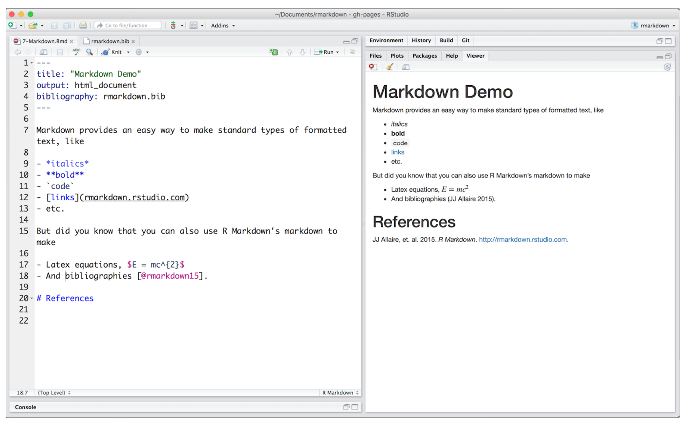

Building websites uses the same reproducible workflow you can use for your analyses and collaborations. It is very iterative. You can do it all from RStudio, with a combination of clicking or typing commands as you feel comfortable. 

1. add content (text, code, images, etc) in an RMarkdown file
1. knit the RMarkdown file to view
1. update `_site.yml` (perhaps, if it is a new file)
1. build the website
    - Build tab > Build Website or
    - in the console: `rmarkdown::render_site()`
1. repeat, repeat, repeat
1. commit and push your website to github, it's live!
1. repeat all of the above

Let's see what this looks like. We are not going to have time to learn all of the capabilities of R Markdown today, but the purpose here is to give you familiarlity with the workflow and confidence to explore further on your own.

----

## RStudio landscape

Here is what you'll see when you've opened our `rmarkdown-website-tutorial` project in RStudio.  

The 'Build tab' in the top right corner will show up once RStudio knows you're making a website, don't worry if you don't have it yet.  

If we open `index.Rmd` we will see that it's all text with a bit of formatting. This top part is called the 'front matter'.  


<br>
 
## Markdown Syntax 
 
Now let's look explore the first few webpages/R Markdown files to get familiar with Markdown syntax: 

- `index.Rmd`
- `first_observations.Rmd`
- `basic_workflow.Rmd`

These first few pages have simple formatting (**bold**, *italics*), headers, bullet points, links, and images. These are the majority of things you'll do in Markdown. See a full list of options at [**RStudio's Markdown basics**](http://rmarkdown.rstudio.com/authoring_basics.html) or go to Help > Markdown Quick Reference. Also, check out their [R Markdown cheatsheet](https://www.rstudio.com/resources/cheatsheets/).  

Notice that you can insert images locally (from the /images folder), or from online e.g. Google Drawings!
 
From [rmarkdown.rstudio.com lesson 8](http://rmarkdown.rstudio.com/lesson-8.html): 




<br> 

## Build your website!

Let's make a few changes to this file and knit it to inspect. Try adding some new Markdown formatted text. 

Also, now is a good time to make sure you have the the Build tab; you may need to install `rmarkdown` if you haven't already (below). 

Click `Build Website` in the Build tab (or type `rmarkdown::render_site()` in the Console) and inspect your Website! Commit and push to see it live online. 

<br>

## Other

### Tips for learning Markdown

**In Markdown, spaces can be tricky**.  
To start a new line here, I needed 2 spaces after `tricky.  ` above. 
As you can see, a simple carriage return doesn't cut it. 

To force carriage returns, use the `<br>` html tag...

<br>
<br>

...like this.  

Also, this bulleted list won't render properly:
- because there is no carriage return between the line above
- and where the bullet points start. 

To have the bullet points render nicely: 

- you must have a full blank line 
- following "To have the bullet points render nicely:"

<br>

### Building a website from scratch

If you want to build a website from scratch (i.e. not fork this one), follow RStudio's instructions here: [R Markdown Websites
](https://rmarkdown.rstudio.com/rmarkdown_websites.html). 

**Troubleshooting:**  

We recently had trouble having our nicely built website display online: the website's url only showed the README (nicely formatted though!). We solved it by adding:

```
output_dir: "."
```

to the `_site.yml`. This knits all the .html files in place in the home directory instead of in a `_site` folder, and this solved our problem!

### Install the `rmarkdown` package

You can do this by: 

1. paste this code in the Console and hit enter

    ```
    install.packages('rmarkdown')
    library(rmarkdown) 
    ```
1. from the menu bar select: Tools > Install Packages... "rmarkdown"
1. from the bottom right pane, click on the Packages tab, click on Install, "rmarkdown"

<!---note that the ``` ``` syntax above renders text as a code-looking block--->


