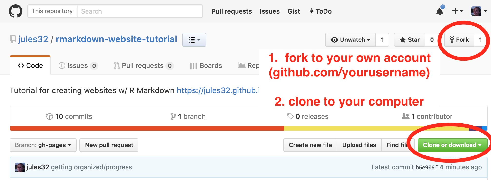

With this tutorial, we have a working example website that we will explore together. We'll start our exploration online looking at the website architecture, then we'll clone the repo to our local computers. Locally, we will explore further by going back and forth between the R Markdown editor and built webpages, and make modifications. Pushing to Github will make our modifications live!    

We'll also borrow heavily from [RStudio's instructions for R Markdown websites](http://rmarkdown.rstudio.com/rmarkdown_websites.html), which is highly recommended reading.

----

## Exploring online

 

### The website itself

This website has 4 pages: 

- Home
- First Observations
- Basic Workflow
- Getting Sophisticated
  
  
`github.io` means that there is a Github repo behind this website, and we also know the username and repo name:

**<http://jules32.github.io/rmarkdown-website-tutorial>** <=> **<https://github.com/jules32/rmarkdown-website-tutorial>** 

(Note: you can have github websites point to different urls if you don't want the `github.io`.)

 

### The website's repo

**First, note the `gh-pages` branch** - this is critical for building free webpages. You can usually name branches whatever you want, but the `gh-pages` name means it can be built as a website. [I set it as my default branch](https://help.github.com/articles/setting-the-default-branch/).

 

**Now let's look at the filenames**. We can recognize the names of the webpages we've seen, and there is also a `_site.yml` file, which is the website's configuration file. The simplest website possible would have 2 files only: `_site.yml` and `index.Rmd`

## Fork to your account, clone to your computer

Let's start digging deeper and playing with this.  

First, fork the [jules32/rmarkdown-website-tutorial](https://github.com/jules32/rmarkdown-website-tutorial) repo into your own account. Then, clone to your local computer using RStudio (preferred) the [Desktop App](https://desktop.github.com/), or the command line.

## RStudio landscape

screenshot of RStudio pane, highlight knit buttons
 
 
## Markdown Syntax 
 
screenshot garrett

## 'Front matter'

yaml

