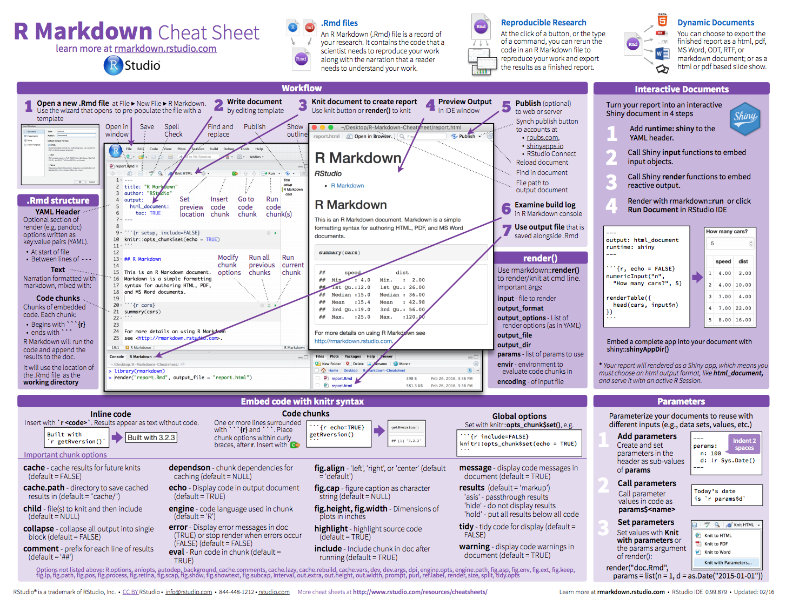

There are a lot of ways to get sophisticated here, and we're only covering a few possibilites here. See [RStudio's R Markdown lessons](http://rmarkdown.rstudio.com/lesson-1.html) for other R Markdown capabilities. Plus, R Markdown can render styling from Cascading Style Sheets (CSS) and Hyper Text Markup Language (HTML), which is what non-R Markdown websites use.  

So, Googling what you want to do and trying it in your R Markdown files is a good way to learn. Disclaimer: that's how I've learned the following, so there are most definitely better and more elegant ways to do this. But here are some ideas of what you may want to do with your website. 

----

## R Markdown options 

These are options that you can do from the Front Matter. 

<br>

### Table of Contents

Note that on this page: 

1. there is a Table of Contents (TOC) there on the left, and 
1. it is floating (i.e. it follows you as you scroll down and expands/collapses nicely as you click)
1. This is all done in the front matter:  
```
    output:  
      html_document:  
        toc: true  
        toc_float: true  
```  
<!---also note that my numbering in this list renders nicely--->

<br>

### Themes

We can change the website's theme in `_site.yml`. Explore options here: <http://rmarkdown.rstudio.com/html_document_format.html#appearance_and_style>:

>Valid themes include "default", "cerulean", "journal", "flatly", "readable", "spacelab",  "united", "cosmo", "lumen", "paper", "sandstone", "simplex", and "yeti". 


----

## Simple styling


### images

By default, images are displayed left-aligned. 

**Resize** an image using HTML tags (side note: check out [RStudio's R Markdown Cheatsheet](https://www.rstudio.com/resources/cheatsheets/)):

Here's a big image:  
``  


And a small image:   
``  


  
**Align** an image using HTML tags: 

Small image centered:  
`<center></center>` 

<center></center>

Small image right-aligned:   
`<div align="right"></div>`

<div align="right"></div>

<br> 


### columns
 
<!---From http://stackoverflow.com/questions/31753897/2-column-section-in-r-markdown:
Put in your css file or directly in rmarkdown--->
<style>
  .col2 {
    columns: 2 200px;         /* number of columns and width in pixels*/
    -webkit-columns: 2 200px; /* chrome, safari */
    -moz-columns: 2 200px;    /* firefox */
  }
</style>
 

<div class="col2">
**Column 1**

- note `<div class="col2">` and `</div>`
- what beautiful bullet points
<br>
<br>

**Column 2**

- I have 3 bullet points here
- which means to align with the left column
- I added a `<br>` there
</div>

<br>

<center>
`<center>**Here the text is centered. Here are good resources:**</center>`  
**Here the text is centered. Here are good resources:**

• [w3schools.com - HTML references](http://www.w3schools.com/tags/) • [w3schools.com - CSS tutorial](http://www.w3schools.com/css/) • 
</center>

<br>

### colored text

`<font size="3" color="red">Text here!</font>`

<font size="3" color="red">This is red text size 3!</font>  
<font size="2" color="blue">This is blue text size 2!</font>  
<font face="verdana" color="green">This is green text in verdana!</font>

---- 

## `R` code

You can execute R code each time you build your website. Even if you don't yet know R, this is a little taste of the types of things you can do. There are two ways you'll see R code; in-line and in a code chunk. This is from the [R Markdown chapter in R for Data Science](http://r4ds.had.co.nz/r-markdown.html).


<br>

### in line

Here is an example inline. The date when I last built the website is `r Sys.Date()`. My favorite number is `r pi + 10`. There are `r length(list.files())` files and folders in our repo. This is not just text; his is executable R code that is `r 10 * 10`% awesome!

<br>

### in a code chunk

And here is an example of a code chunk. Let's plot the first bit of an `iris` variable (which is a dataset that comes with base R). 

```{r plot iris}
x <- iris$Sepal.Length[1:15]
plot(x)
```

### calling another file 

#### `R` script

You can source an R script. This is a super powerful way to avoid copy-pasting your analyses. For example: 

```{r source gdp script, echo=T, warning=FALSE, message=F}
## source an external script 
source("advanced/my_script.R")

## use the calc_gdp() function `my_script.R`
my_data <- calc_gdp(my_country <- 'Slovenia')

ggplot(data = my_data, aes(x = year, y = pop)) + 
  geom_point() + 
  labs(title = my_data$country)
```

<br>

#### A specific R script: `_site.R`

This is something that R Markdown websites will look for; when it exists it will give you 'global variables' that will be available for all pages across your site.

```{r _site.R, eval=FALSE, warning=FALSE, message=F}
source("_site.R")
```
 
<br>

#### R Markdown file 

You can insert separate R Markdown files too; text and code will be incorporated seamlessly into this page. This R Markdown file is considered the 'parent' file, and the one that is incorporated is the 'child' file. In the code chunk below, we'll say `{r, child='advanced/important_example.Rmd'}`. 

```{r child, child='advanced/example.Rmd'}
```
 
<br>

## Troubleshooting

You'll get errors as you work; this is how you learn. These are a few things you may encounter: 

1. If when running `rmarkdown::render_site()` you get this error: 

    ```
    Error in object[seq_len(ile)] : 
    object of type 'symbol' is not subsettable
    ```
Go to *Session > Restart R* and try again. 

2. When knitting, if you get this error: 

    ```
    Error in parse_block(g[-1], g[1], params.src) : duplicate label 'setup'
    Calls: <Anonymous> ... process_file -> split_file -> lapply -> FUN -> parse_block
    Execution halted
    ```
Here you have 2 `R` code chunks named the same thing (in this case 'setup'), you must change one of them because there cannot be two code chunks with the same name.


3. When you get an error message you don't understand: Copy-paste it into Google.

<center></center>
  

