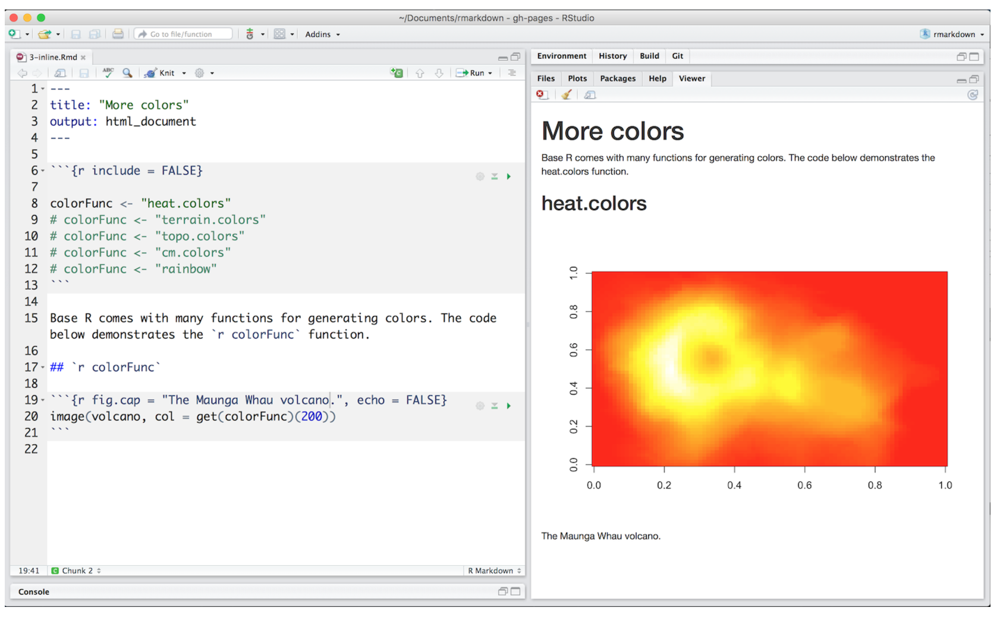

We're only covering a few possibilites here; see [RStudio's R Markdown lessons](http://rmarkdown.rstudio.com/lesson-1.html) for the complete picture.

<br>

**First off**, note that: 

1. there is a table of contents there on the left, and 
1. it is floating (i.e. it follows you as you scroll down)
1. it collapses nicely as you click it
1. This is all done in the front matter:  
```
    output:  
      html_document:  
        toc: true  
        toc_float: true  
```  
<!---also note that my numbering in this list renders nicely--->


----

## `R` code

You can execute R code each time you build your website. There are two ways you'll see R code; in-line and in a chunk. 



### in line

Here is an example inline. The date when I last built the website is `r Sys.Date()`. My favorite number is `r pi + 10`.

### in a code chunk

And here is an example of a code chunk. 

```{r plot iris}
plot(iris$Sepal.Length)
```

### Calling another file 

#### R script

You can source an R script. For example, 

```{r plot, echo=T, warning=FALSE, message=F}
source("plot_script.R")
```


#### `_site.R`

Will give you 'global variables' that will be available across your site. Note: we'll move

```{r setup, eval=FALSE, warning=FALSE, message=F}
source("_site.R")
```
 
#### Rmd file 

with `child='myfile.Rmd'`
 
<br> 

## Simple styling

Disclaimer: Most of what is here I figured out through Googling and trial and error...so there are most definitely better and more elegant ways to do this. But here are some ideas using CSS and HTML. 

### images

**Resize** an image using HTML tags (Check out [RStudio's R Markdown Cheatsheet!](https://www.rstudio.com/resources/cheatsheets/))


  
**Align** an image using HTML tags. 

Center: 

<center></center>

Right: 

<div align="right"></div>

<br> 

### Columns
 
<!---From http://stackoverflow.com/questions/31753897/2-column-section-in-r-markdown:
Put in your css file or directly in rmarkdown--->
<style>
  .col2 {
    columns: 2 200px;         /* number of columns and width in pixels*/
    -webkit-columns: 2 200px; /* chrome, safari */
    -moz-columns: 2 200px;    /* firefox */
  }
</style>
 
-----

<div class="col2">
**Column 1**

- note `<div class="col2">` and `</div>`
- what beautiful bullet points
<br>
<br>

**Column 2**

- I have 3 bullet points here
- which means to align with the left column
- I added a `<br>` there
</div>

<br>

<center>
**Here the text is centered.**

• [w3schools.com - HTML references](http://www.w3schools.com/tags/) • [w3schools.com - CSS tutorial](http://www.w3schools.com/css/) • 
</center>

---- 


### colored text

<font size="3" color="red">This is red text size 3!</font>
<font size="2" color="blue">This is blue text size 2!</font>
<font face="verdana" color="green">This is green text in verdana!</font>

## Themes

We can change the website's theme in `_site.yml`. Explore options here: <http://rmarkdown.rstudio.com/html_document_format.html#appearance_and_style>:

>Valid themes include "default", "cerulean", "journal", "flatly", "readable", "spacelab",  "united", "cosmo", "lumen", "paper", "sandstone", "simplex", and "yeti". 


## Troubleshooting

You'll get errors as you work; this is how you learn. 

1. If when running `rmarkdown::render_site()` you get this error: 

    ```
    Error in object[seq_len(ile)] : 
    object of type 'symbol' is not subsettable
    ```
Go to *Session > Restart R* and try again. 

2. When knitting, if you get this error: 

    ```
    Error in parse_block(g[-1], g[1], params.src) : duplicate label 'setup'
    Calls: <Anonymous> ... process_file -> split_file -> lapply -> FUN -> parse_block
    Execution halted
    ```
Here you have 2 `R` code chunks named 'setup', you must change it


3. When you get an error message you don't understand: Copy-paste it into Google.


  

